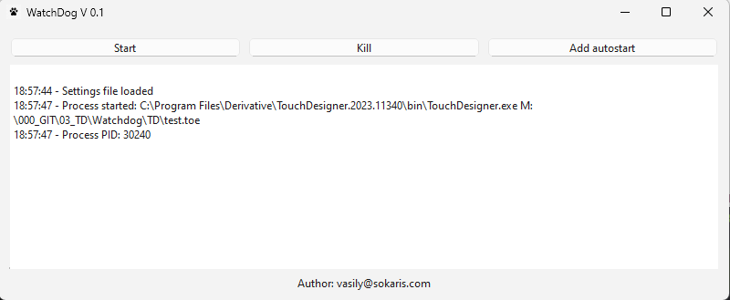
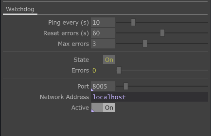

# TDWatchdog

*The main program window*




*TouchDesigner component for script communication*


- Ping every (how often it should send a ping to the watchdog server)
- Reset errors (it would reset the error count if the installation is running without errors)
- Max errors (how many errors can the installation have before it stops sending ping)

TDWatchdog is a simple Python script that can handle logging and status for the installations.

## Usage
1. Download the release
2. Start TDWatchdog.exe to launch the app
3. Modify settings.json to configure the application settings.
4. Utilize the TD folder for the TouchDesigner component, which facilitates script communication. This component can be customized based on the installation's status, such as checking sensors or local errors.

## Settings file
```json
{
  "app": "C:/path/to/your/application.exe",
  "args": ["-arg1", "-arg2"],
  "ports": [8000, 8005],  // Ports for the watchdog server and the TouchDesigner component (now it would listen to the second port)
  "ping_time": 10,        // How often it would wait before triggering the timeout
  "wait": 20,             // How long it would wait after starting the application before starting listening for pings
  "reboot": 3,            // How many times it would restart the application before rebooting the system, 0 for infinite
  "autostart": true       // Whether it should start the application on the service start
}
```

## Functionality
- Reads settings and launches the application with specified arguments.
- Automatically restarts the application if no ping is received.
- Restart the system if the application error count exceeds the maximum limit.
- Adds or removes itself from system startup.
- Provides robust logging of application status.
- Keep only one instance of the app, preventing 'double launching' that could be critical for hardware access and control.

## Planned Features
- Monitoring multiple applications.
- Remote system management (start, reboot, shutdown).
- Remote system monitoring.
- Integration with APIs for online status reporting (e.g., PM2).

## Development
Run to install the required packages.
```bash
install.bat
```

Use compile script to compile to executable file
```bash
compile.bat
```

## License
This project is licensed under the [MIT License](https://choosealicense.com/licenses/mit/)
